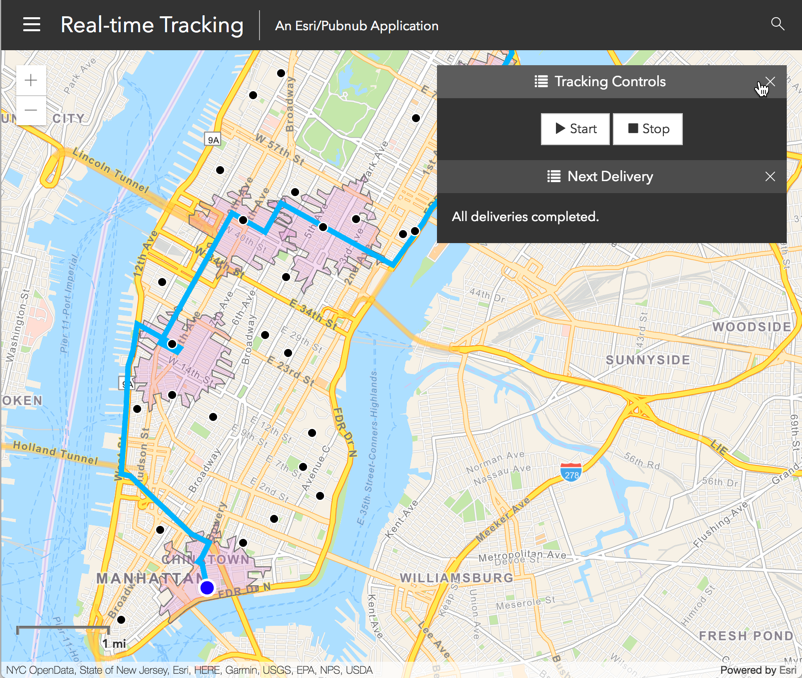

# Overview
A serverless solution to calculate and manage deliveries by a driver to customers in realtime. This is a work-in-progress/prototype built on ArcGIS Online and Pubnub.

​

# Features
* Serverless architecture using ArcGIS Online and PubNub cloud solutions.
* Use ArcGIS Online to generate optimal delivery routes with drive-time geotriggers.
* PubNub Function for realtime geotriggering of imminent deliveries.
* Secure communication between PubNub Function and ArcGIS Online.
* ArcGIS JS API Delivery Tracking App.
* Simulator app.

# Prerequisites
* Local clone of this repo.
* Local web server pointing to the clone of this repo.
* [Free ArcGIS Developer account](https://developers.arcgis.com/sign-up).
* PubNub account.

## Architecture
The demo consists of a JavaScript Delivery Tracking app, ArcGIS Online hosted layers to store and analyze spatial data, and a PubNub function that uses those hosted layers in real-time to monitor driver location updates from the field and notify customers as their deliveries get close.

The Delivery Tracking app uses ArcGIS Online to generate the optimal route from the driver to the randomly selected customers. ArcGIS Online will then also generate DriveTime areas. These are polygons that represent an area <= 5 minutes' drive from the customer. PubNub monitors the driver location in relation to these DriveTime areas and alerts the customer when the driver is 5 minutes away.

This demo uses one driver (although it can handle any number) and picks randomly from a set of 30 fictional customers around Manhattan. The demo also includes a Driver Simulator that mimmicks the driver following the generated delivery route.

## Instructions

There are 3 high-level steps to getting this demo working in your own environment.

1) ArcGIS Online: Create geographic hosted layers and an Application (for authentication token generation). These layers are geospatially-enabled services.
2) PubNub: Configure a new Function to use the above layers and application token configuration.
3) Locally: Configure the Delivery Tracking App (index.html) and Driver Simulator to use the above PubNub and ArcGIS Online components.


### 1. Set up ArcGIS
1. Sign in at [developers.arcgis.com](https://developers.arcgis.com).
2. [Create an application](https://developers.arcgis.com/applications/new). You can call it whatever you like and give it any tags. Once created, take note of the `Client ID` and `Client Secret`. You'll use these when you configure the PubNub Function below.
3. Create the DeliveryTracking layers. These are REST-enabled spatial database tables hosted in the ArcGIS Online cloud. They will store points, lines and polygons that are used by the app:
    1. Log in at [arcgis.com](https://www.arcgis.com/home/signin.html) with your Developer Account
    2. Browse to the `Content` section.
    3. Select `Add Item`->`From my computer`.
    4. Browse to the [DeliveryTracking.sd](Service%20Definitions/DeliveryTracking.sd) file. Ensure the `Publish this file as a hosted layer` checkbox is checked. Upload the file.
    5. Once ArcGIS Online has finished creating the layer, make a note of the service **URL** found at the bottom-right of the newly created item's page.
4. Create the DeliveryDriverSim hosted layers. These are used by the demo's Driver Simulator. Repeat step 3, but use the [DeliveryDriverSim.sd](Service%20Definitions/DeliveryDriverSim.sd) file.

### 2. Set up PubNub
1. Sign in at [pubnub.com](https://admin.pubnub.com/).
2. Make a note of the Demo Project's Demo Keyset's `Publish` and `Subscribe` keys from the [Admin panel](https://admin.pubnub.com/).
3. Create a Module named `Delivery Tracking Module` and a Function within it named `Delivery Tracking Function` (those are just suggestions you can pick whatever names you want). When prompted choose the following (these must be as specified):
    * Event type: `Before Publish or Fire`
    * Channel: `all_driver_updates`
4. Copy the contents of the [driver-location-update.js](driver-location-update.js) file into the PubNub Function and Save it.

### 3. Configure the components
1. Configure the PubNub Function:
    1. Update `clientID` and `clientSecret` with the Client ID and Client Secret from step 1.2.
    2. Update `baseURL` with the DeliveryTracking URL from step 1.3.v.
    3. Set (and save) the Test Payload with:
        ```
        {
            "driverId": "220C9781-DEB7-40F8-8452-2B6E238D9C33",
            "lat": 40.778215274460635,
            "lng": -73.97792446022514
        }
        ```
    4. Save and start (or restart) the module.
    5. Publish the test payload and ensure the output shows no errors.

2. Configure the Delivery Tracking app. Edit [index.html](index.html) and locate the `initConfig()` function:
    1. Set the PubNub keys from step 2.2. 
    2. Set the URLs to the Feature Service URLs from steps 1.3 (`serviceURL`) and 1.4 (`simServiceURL`).

3. Configure the Driver Simulator. Edit [simulate-driver.html](simulate-driver.html) and locate the `initConfig()` function:
    1. Set the PubNub keys from step 2.2. 
    2. Set the URLs to the Feature Service URLs from steps 1.3 (`serviceURL`) and 1.4 (`simServiceURL`).

## Resources

* [ArcGIS Blog](http://blogs.esri.com/esri/arcgis/)
* [@esri](http://twitter.com/esri) on twitter

## Issues
Find a bug or want to request a new feature?  Please let us know by submitting an issue.

## Contributing
Esri welcomes contributions from anyone and everyone. Please see our [guidelines for contributing](https://github.com/esri/contributing).

## Licensing
Copyright 2017 Esri


Licensed under the Apache License, Version 2.0 (the "License");
you may not use this file except in compliance with the License.
You may obtain a copy of the License at


   http://www.apache.org/licenses/LICENSE-2.0


Unless required by applicable law or agreed to in writing, software
distributed under the License is distributed on an "AS IS" BASIS,
WITHOUT WARRANTIES OR CONDITIONS OF ANY KIND, either express or implied.
See the License for the specific language governing permissions and
limitations under the License.


A copy of the license is available in the repository's [license.txt](https://github.com/Esri/pubnub-delivery-tracking-demo/blob/master/license.txt) file
